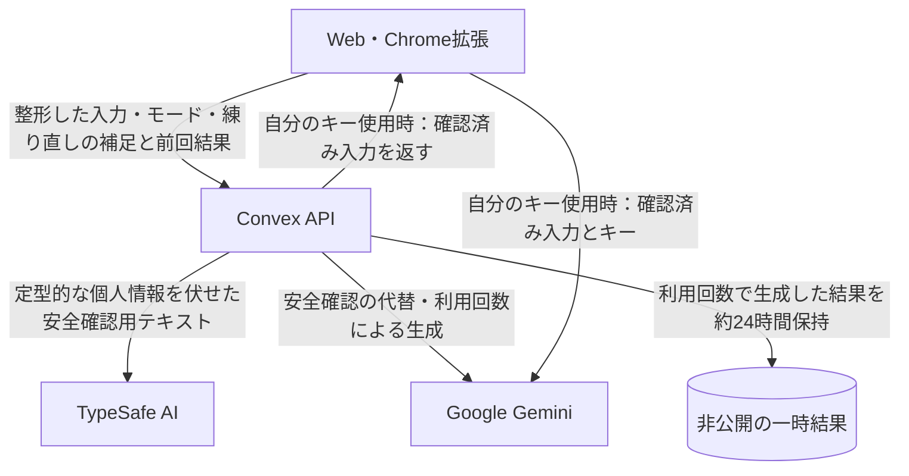

# データの扱いと確認できるコード

この文書は、リポジトリ内の実装を説明します。説明の実装基点は `6a8dc2ef7b4f96e14413a29f78a4563fd9825e49`（2026-09-28）。本番サービスやストア配布版との対応は[版と検証の見方](source-and-releases.md)で区別します。

## 生成するとき

### 利用回数で使う

1. 端末で入力を整形してConvexへ送り、回答モード等を指定します。練り直しでは補足と前回結果も送ります。
2. Convexが接続情報・残数を確認し、1回分を予約します。定型的なメール・番号・アカウント表記・URLを伏せ、安全確認を行います。
3. Convexから運営のAPIキーでGoogle Geminiへ生成を依頼し、返ってきた本文も安全確認します。
4. 成功した結果を返し、再送に備えて非公開で保持します。失敗時は予約した利用回数を戻す処理があります。

### 自分のGemini APIキーで使う（BYOK）

1. キーはWebではページのメモリ、拡張では `chrome.storage.local` に保持します。Convexへ渡すリクエストに本人のキーは含めません。
2. 入力等をConvexへ送り、同じ安全確認を受けます。安全確認には運営側のキーを使います。
3. 戻ってきた確認済み入力を、端末から本人のキーとともにGoogle Geminiへ直接送ります。キーはURLではなく `x-goog-api-key` ヘッダーに入れます。
4. 結果は端末へ直接返り、形式・定型的な個人情報を共通コードで検査・整形します。この経路では、公開しない新しい結果に対するサーバー側AI安全確認・一時結果保存は行いません。公開時や次の練り直しでは対象本文を再びサーバーへ送ります。

BYOKではMonku Fusionの利用回数を消費しません。Google側の料金・上限は本人のキーに適用されます。

根拠：[Webの生成](../src/app/page.tsx)、[拡張の生成](../extension/sidepanel.tsx)、[APIの生成・安全確認ルート](../convex/http.ts)、[共通の整形と生成](../shared/fusion.ts)。

## 外部サービスへ渡すもの

| 送信先 | 用途と送る情報 |
|---|---|
| Convex | API処理とアプリDB。入力、生成・公開に必要な本文、接続トークンまたはClerkの認証トークン、処理識別子を扱います |
| Google Gemini | プロンプト、整形した入力、回答モード等。練り直しでは補足・前回結果も送ります。安全確認の代替にも使います |
| TypeSafe AI | `TYPESAFE_API_KEY` が設定されていれば、整形した入力・安全確認対象の生成結果・公開本文を `jev-latest` へ送ります |
| Clerk | 登録・ログイン・退会。メール等の認証情報を扱い、Convexは認証済みのユーザー識別子を検証します |
| Googleログイン | 選択した場合、アカウント識別情報・メール・基本プロフィールをClerkへ共有します。Gmail本文を読む機能は実装していません |
| Stripe | Checkoutでカード情報を扱います。Convexから購入金額・商品・財布ID等を渡し、支払い・返金を照合します |
| Cloudflare | Webの静的配信と初回のTurnstile確認。ConvexからTurnstileの応答トークンを検証APIへ送ります |

TypeSafeが未設定、通信失敗、または判定形式が不正な場合は、運営のGeminiで一度だけ代替確認します。TypeSafeが危険と判定したものを代替で通す処理はありません。代替も失敗・不正なら処理を止めます。[実装](../convex/safety.ts)

入力の伏せ字処理はWeb・拡張とConvexの両方で行います。練り直しの補足・前回結果もConvex側で検証・整形します。すべての名前・住所等を除ける保証はありません。APIキー以外の入力欄へ、秘密や個人を特定できる情報を入れないでください。

「原文をアプリDBへ保存しない」は、処理のための送信も行わないという意味ではありません。通信に伴う情報、各サービス側のログ・保持・学習利用等は、契約・設定・サービス側のポリシーにも依存します。このリポジトリだけで外部サービスの内部処理は検証できません。

## 保存する場所と期間

| 情報 | 保存場所・保持の仕方 |
|---|---|
| 入力原文・練り直しの補足 | 表示中の画面のメモリ。現在のAPIはアプリDBへ本文を自動保存しません |
| 自分のGemini APIキー（Web） | ページのメモリ。再読み込みで消えます |
| 自分のGemini APIキー（拡張） | 拡張のローカル領域。設定で保存・削除。暗号化保管庫ではありません |
| 接続トークン | WebのlocalStorage／拡張のローカル領域。Convexの資格情報テーブルにはSHA-256のハッシュを保存します |
| 画面言語・スキン・回答言語 | WebのlocalStorage／拡張のローカル領域 |
| 右クリックで選択した文章 | 拡張のセッション領域へ一時保存し、パネルの受け取り時に削除。表示中の文章はパネルのメモリに残ります |
| 利用回数で生成した結果 | Convexの `requests.result`。予約から約24時間後の処理で本文を除きます |
| 処理ID・状態・入力ハッシュ | Convexの `requests`。結果の本文を除いた後も二重消費を防ぐため保持。定期削除期限は設定していません |
| 残数・アカウントとの紐付け | Convexの `wallets`・`accountWallets`。メール本文やパスワードはこのテーブルに保存しません |
| いいね | Convexの `accountLikes`。本人が取得・変更する一覧で、いいねした人の一覧は公開しません |
| 購入・返金の照合記録 | Convexの `purchases` とStripe。決済識別子・財布ID・金額・返金識別子等。アプリ側に自動削除期限はありません |
| 公開したアイデア | Convexの `fusions`。本人が確認した7項目、きっかけの説明、モード、ジャンル、日時等 |
| 退会の進行状況 | Convexの `retirements`。ブラウザの受付情報はsessionStorageへ保存し、完了確認後に除きます |
| コピー・テキスト保存 | 本人のクリップボード／保存先ファイル。書き出しには入力と補足も含まれます |

入力ハッシュは照合用であり、暗号化した原文の保管ではありません。短い既知の入力との一致を推測できる場合があるため、ハッシュも非公開データとして扱います。

約24時間は予約処理の設定値です。処理遅延やサービス側のバックアップの保持まで含めた厳密な消去時刻を示すものではありません。

根拠：[DB定義](../convex/schema.ts)、[残数・一時結果](../convex/incense.ts)、[Web接続](../src/lib-session.ts)、[表示設定](../src/components/PreferencesProvider.tsx)、[拡張の保存](../extension/sidepanel.tsx)、[文章の取り込み](../extension/background.js)。

DB定義には旧版との互換用に `rawNoise`、`originalText` などが残ります。現在の公開保存は `rawNoise: ""` を書き込み、旧変換APIは停止しています。旧環境に残るデータの有無や削除済みかどうかを、このコードだけから判断することはできません。[現在の保存処理](../convex/fusions.ts)、[停止済みの旧処理](../convex/transformations.ts)

## 登録・拡張との接続・退会

未ログインの残数は、秘密の接続トークンを持つ端末から使えます。トークンを紛失した場合の自動復元はありません。Clerkでログインして紐付けると、同じアカウントから残数を利用できます。既に別の接続が紐付いている場合、勝手にアカウントを統合しません。

拡張への連携コードは10分・1回限りです。本人がWebでアカウント権限を選んで発行した接続は30日間有効で、全件・いいね・自分の投稿を利用できます。Webまたは拡張から解除できます。旧残数共有トークンに、このアカウント権限を自動で足す処理はありません。接続を解除しても、残数・投稿・いいね自体は残ります。

退会では、公開投稿の削除／アカウントとの紐付けを外して保持を本人が選び、未使用回数の失効に同意します。Clerkの本人を確認して財布を閉鎖し、Clerkアカウント、いいね、接続資格情報、接続コード、一時結果、アカウント紐付けを削除します。失敗した削除はサーバーで再試行します。

決済照合に必要な記録と閉じた財布、退会済みを判定するユーザー識別子のハッシュ・受付情報のハッシュ・処理状況等は残します。保持を選んだ投稿は所有者との紐付けを除き、本文は書き換えません。本文に本人を示す内容があれば、それも残るため、必要なら削除を選んでください。

根拠：[認証とHTTPルート](../convex/http.ts)、[接続・権限](../convex/incense.ts)、[退会](../convex/accountRetirement.ts)。

## 決済と公開アイデア

決済はStripe Checkoutで行います。ブラウザの「成功」表示だけで回数を増やさず、Stripeからセッションを取得し、支払済み・100円・JPY・専用商品・10回分を照合します。本人からの確認では財布の一致も検証します。Webhookは署名を必須とし、同じ決済を二重加算しません。退会後に決済が完了した場合は財布を復活させず、返金処理へ回します。[Stripe](../convex/stripe.ts)、[付与・返金記録](../convex/incense.ts)

投稿は明示的な同意と安全確認後に公開します。入力・補足・比較履歴を自動で公開へ転記する処理はありません。公開APIは所有者の識別子、接続情報、決済情報、照合ハッシュを返しません。投稿者による取り下げは可能ですが、第三者が取得したコピーやCC0の利用許諾を回収する処理ではありません。[公開・一覧・取り下げ](../convex/fusions.ts)

実装の問題は [SECURITY.md](../SECURITY.md)、利用や削除の相談は[問い合わせ窓口](https://monku.ai/contact/)へご連絡ください。
